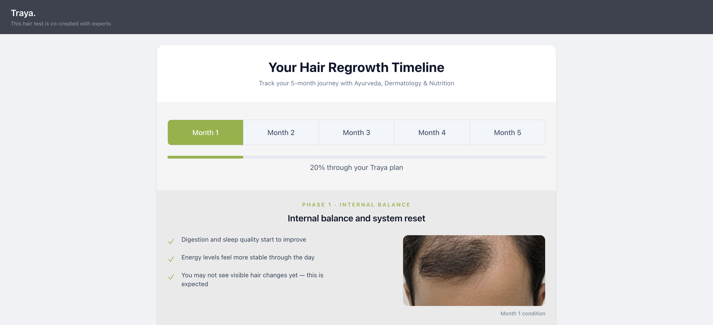

# Traya Journey (Frontend)

A small React UI that visualizes a **5‑month hair regrowth journey** with:

- **Month selector** (Month 1 → Month 5)
- **Progress bar** showing completion percentage
- **Phase details** (Internal Balance → Scalp Health → Regrowth)
- **Before/After** view (Month 1 vs Month 5)
- **Mock month images** to represent hair/scalp pattern changes over time

## Tech Stack

- **React** (UI)
- **TypeScript** (type-safety)
- **Vite** (dev server + bundler)
- **Tailwind CSS** (styling)
- **ESLint** (linting)

## Key Features

- **Progress Timeline**
  - Month tabs for navigation
  - Progress bar updates as you change month
- **Phase Details (dynamic)**
  - Phase content is computed based on the selected month
  - Month-wise image support using `import.meta.glob` (Vite)
- **Before / After Preview**
  - Toggle between Month 1 (Before) and Month 5 (After)
- **Mock Images for Hair Patterns**
  - Drop placeholder/mock images in `src/assets/images` and map them in `src/data/journeyData.json`

## SDE-1 Frontend Assignment Brief Coverage

This project covers the requirements from the assignment brief:

### Objective

- **Responsive + interactive Traya Journey component**
  - Implemented as a single interactive journey screen with month navigation, phase content, and trust elements.

### Problem Statement

- **Clear 5-month expectation setting**
  - Month navigation + progress percentage UI
  - Phase copy updates based on selected month (3-phase logic)

### Feature Requirements

- **Interactive Timeline (Month 1 → Month 5)**
  - Month selector + progress bar
- **Phase Logic (3 phases)**
  - Phase 1: Month 1 (Internal Balance)
  - Phase 2: Months 2–3 (Scalp Health)
  - Phase 3: Months 4–5 (Regrowth)
  - Implemented via month → phase mapping
- **Before/After Comparison**
  - Uses Month 1 as **Before** and Month 5 as **After**
- **Trust Widget (mock verified reviews + star ratings)**
  - Includes mock verified review cards + star ratings

### Technical Constraints

- **React (Functional components + Hooks)**
  - Uses `useState` / `useMemo` across journey components
- **Styling (Tailwind, mobile-first)**
  - Tailwind classes across components, with responsive utilities (`sm:`, `md:`)
- **Data (local JSON ingest)**
  - Month image mapping comes from a local JSON file
- **Performance (avoid layout shift / CLS)**
  - Image containers use fixed heights (e.g. `h-32`, `h-40`, `h-52`, `h-60`) to keep layout stable while switching months

### Evaluation Criteria Mapping

- **Code Quality**
  - Modular components (`Timeline`, `PhaseDetails`, `BeforeAfter`, `TrustWidget`)
  - Prop typing via TypeScript types
- **UI/UX**
  - Smooth progress bar transition (`transition-all duration-300`)
  - Mobile-first layouts with responsive breakpoints
- **Logic**
  - Single source of truth: `selectedMonth` state in `TrayaJourney.tsx`
  - Derived values via `useMemo` (`phase`) and computed percentage

## Project Screenshots

Add your screenshots here (replace file names/paths as needed):




## Responsiveness (Mobile-first)

The UI is built with a **mobile-first approach** using Tailwind responsive utilities (`sm:`, `md:`), ensuring good fidelity on small screens first and scaling up cleanly for larger devices.

## Getting Started

### Prerequisites

- Node.js (LTS recommended)
- npm (or pnpm/yarn if you prefer)

### Install

```bash
npm install
```

### Run (Development)

```bash
npm run dev
```

### Build

```bash
npm run build
```

### Preview Production Build

```bash
npm run preview
```

### Lint

```bash
npm run lint
```
